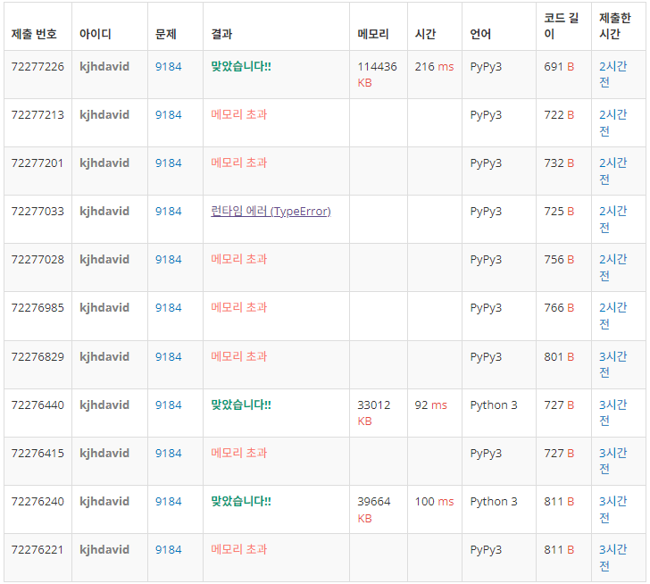

# Index

+ [권준혁](#권준혁)
+ [안지완](#안지완)
+ [오효근](#오효근)
+ [조은학](#조은학)

---

# [신나는 함수 실행](https://www.acmicpc.net/problem/9184)

재귀 호출만 생각하면 신이 난다! 아닌가요?

다음과 같은 재귀함수 w(a, b, c)가 있다.

```
if a <= 0 or b <= 0 or c <= 0, then w(a, b, c) returns:
    1

if a > 20 or b > 20 or c > 20, then w(a, b, c) returns:
    w(20, 20, 20)

if a < b and b < c, then w(a, b, c) returns:
    w(a, b, c-1) + w(a, b-1, c-1) - w(a, b-1, c)

otherwise it returns:
    w(a-1, b, c) + w(a-1, b-1, c) + w(a-1, b, c-1) - w(a-1, b-1, c-1)
```

위의 함수를 구현하는 것은 매우 쉽다. 하지만, 그대로 구현하면 값을 구하는데 매우 오랜 시간이 걸린다. (예를 들면, a=15, b=15, c=15)

a, b, c가 주어졌을 때, w(a, b, c)를 출력하는 프로그램을 작성하시오.

## 입력

입력은 세 정수 a, b, c로 이루어져 있으며, 한 줄에 하나씩 주어진다. 입력의 마지막은 -1 -1 -1로 나타내며, 세 정수가 모두 -1인 경우는 입력의 마지막을 제외하면 없다.

## 출력

입력으로 주어진 각각의 a, b, c에 대해서, w(a, b, c)를 출력한다.

## 제한

+ -50 ≤ a, b, c ≤ 50

## 예제

> 입력 1

```
1 1 1
2 2 2
10 4 6
50 50 50
-1 7 18
-1 -1 -1
```

> 출력 1

```
w(1, 1, 1) = 2
w(2, 2, 2) = 4
w(10, 4, 6) = 523
w(50, 50, 50) = 1048576
w(-1, 7, 18) = 1
```

---

# [권준혁](https://github.com/tree-jhk)

## 접근법 (생각의 흐름 설명)

<!--문제를 풀며 생각의 흐름을 글로 작성-->
1. 예제 들어보기  
문제를 읽고 예제 입력을 손으로 재귀 호출되는 과정을 작성함.  
그 과정에서 재귀 호출 시에 이전에 호출된 재귀가 다시 반복해서 호출될 가능성을 인지함.  
따라서 이것은 재귀 호출 중의 동적 프로그래밍 문제일 가능성을 염두함.  
달리 말해서, 재귀함수의 동일 입력은 한번만 기록해두면 나중에 동일 입력 시에 동일한 재귀 트리를 형성하지 않도록 함.  
이러한 접근은 재귀 호출 시에 시간을 아끼기 위한 방법 중 하나입니다. 
 
2. 입력 조건 확인하기  
    a. 입력을 3개만 받는다
    b. w의 출력 결과가 항상 양수임이 보장된다.
3. 따라서 3차원 dp를 만들어서, w(a, b, c)가 dp[a, b, c]의 값이 되도록 했음.

## 상세한 해설

<!--기술 면접을 면접관 앞에서 한다는 생각으로 설명-->
<!--시복도, 알고리즘 선택 이유 등-->
1. 주어진 재귀 함수를 그대로 사용할 경우, O(4^N)의 시간복잡도를 가집니다. 하나의 노드에서 자식 노드를 4개까지 가지기 때문.  
2. 이때, 재귀 트리 예제를 작성해보면 동일한 입력이 반복해서 등장합니다. 따라서 이를 O(N^3)으로 바꿔야 합니다. 즉 동일한 입력에 대해서는 한번만 등장하도록 해야 합니다.  
3. 이를 위해 3차원 dp를 만들어서, w(a, b, c)가 dp[a, b, c]의 값을 가지도록 했습니다.

추가적으로, pypy3에서 메모리 초과가 발생했는데, 이는 sys.setrecursionlimit(10 ** 6) 때문이었습니다.  
-> 이것만을 제거해서 실행했더니 pypy3로도 통과가 됐습니다.

## 회고

<!--이런 유형은 이렇게 접근하면 좋겠다 (이유와 함께)-->
해당 유형은 재귀가 포함된 문제입니다.  
재귀 (DFS, 트리 탐색) 유형 풀 때, 시간 복잡도 이슈가 발생한다면:    
1. 재귀 호출 중에 반복되는 입력이 등장하는지 확인해보면 좋겠습니다.  
2. sys.setrecursionlimit(10 ** 6)은 반드시해야하는지 다시 고민해봐야겠습니다.  

## Solution

<!--전체 코드 첨부-->

```python
import sys
input = sys.stdin.readline

dp = [[[0] * 21 for _ in range(21)] for _ in range(21)]

def w(a, b, c):
    if a <= 0 or b <= 0 or c <= 0:
        return 1
    if a > 20 or b > 20 or c > 20:
        return w(20, 20, 20)
    if dp[a][b][c]: # 함수의 출력은 항상 양수이므로
        return dp[a][b][c]
    dp[a][b][c] = w(a, b, c-1) + w(a, b-1, c-1) - w(a, b-1, c) if a < b and b < c else \
                    w(a-1, b, c) + w(a-1, b-1, c) + w(a-1, b, c-1) - w(a-1, b-1, c-1)
    return dp[a][b][c]

if __name__ == '__main__':
    while True:
        a, b, c = map(int, input().split())
        if a == b == c == -1: break
        print(f"w({a}, {b}, {c}) = {w(a, b, c)}")

```

## 속도 및 메모리

<!--백준/프로그래머스 제출 후 메모리 및 속도를 캡처-->

---

# [안지완](https://github.com/synoti21)

## 접근법 (생각의 흐름 설명)

<!--문제를 풀며 생각의 흐름을 글로 작성-->

## 상세한 해설

<!--기술 면접을 면접관 앞에서 한다는 생각으로 설명-->
<!--시복도, 알고리즘 선택 이유 등-->

## 회고

<!--이런 유형은 이렇게 접근하면 좋겠다 (이유와 함께)-->

## Solution

<!--전체 코드 첨부-->

```python

```

## 속도 및 메모리

<!--백준/프로그래머스 제출 후 메모리 및 속도를 캡처-->

---

# [오효근](https://github.com/Zerohertz)

## 접근법 (생각의 흐름 설명)

<!--문제를 풀며 생각의 흐름을 글로 작성-->

우선 문제에서 제시하는 함수를 아래와 같이 Python으로 구현했다.

```python
def recurse(a, b, c):
    if a <= 0 or b <= 0 or c <= 0:
        return 1
    if a > 20 or b > 20 or c > 20:
        return recurse(20, 20, 20)
    if a < b and b < c:
        return recurse(a, b, c - 1) + recurse(a, b - 1, c - 1) - recurse(a, b - 1, c)
    return (
        recurse(a - 1, b, c)
        + recurse(a - 1, b - 1, c)
        + recurse(a - 1, b, c - 1)
        - recurse(a - 1, b - 1, c - 1)
    )

while True:
    a, b, c = map(int, read().split())
    if a == -1 and b == -1 and c == -1:
        break
    print(f"w({a}, {b}, {c}) = {recurse(a, b, c)}")
```

제출하지 않아도 test case에서 충분히 시간 초과가 발생할 것을 예상할 수 있다.
원인은 원자 폭탄과 같이 한번의 실행으로 수많은 실행을 수행하기 때문이다.
이 원인을 파악하고 Fibonacci 수열 예시가 생각났다.
Fibonacci 수열은 재귀로 계산할 경우 `O(2^n)`, DP로 계산할 경우 `O(n)`인데 이러한 차이를 해당 문제에 적용할 수 있다는 생각에서 풀이를 작성했다.

<details>
<summary>
ChatGPT의 Fiboncci 수열 구현
</summary>

```python
def fibonacci_recursive(n):
    # 기저 사례: 0 또는 1일 때
    if n <= 1:
        return n

    # 재귀 호출
    return fibonacci_recursive(n - 1) + fibonacci_recursive(n - 2)

def fibonacci_dp(n):
    # 첫 두 항을 초기화
    fib = [0, 1]
    
    # n이 1보다 작거나 같은 경우, n번째 항을 바로 반환
    if n <= 1:
        return n

    # 2부터 n까지 피보나치 수열 계산
    for i in range(2, n + 1):
        fib.append(fib[i - 1] + fib[i - 2])
    
    return fib[n]
```

</details>

## 상세한 해설

<!--기술 면접을 면접관 앞에서 한다는 생각으로 설명-->
<!--시복도, 알고리즘 선택 이유 등-->

앞선 예제와 같이 해당 문제는 `O(4^n)`인 알고리즘을 `O(n^3)`으로 바꾸는 것이 핵심이다. (3은 `a`, `b`, `c`의 변수에 해당)
따라서 `a`, `b`, `c`를 입력하면 결과가 바로 출력되는 `list`를 선언해야 한다.
여기서 유의할 점은 초기값이 0이 아닌 것이다.

```python
def recurse(a, b, c):
    if a <= 0 or b <= 0 or c <= 0:
        return 1
    ...
```

위와 같이 세 변수 중 어느 하나라도 0 이하이면 `list[a][b][c]`가 1이기 때문에 아래와 같이 선언한다.
그리고 문제에서 제시한 `a`, `b`, `c`의 범위가 -50 ~ 50 이지만, 실제 함수 내에서는 0 ~ 20이 유효한 범위임을 알 수 있다.
따라서 각 변수에 대한 범위를 아래와 같이 `itertools.product`를 사용하여 정의한다. (20 * 20 * 20)

```python
dp = [[[1 for _ in range(21)] for _ in range(21)] for _ in range(21)]
iters = list(product(range(1, 21), repeat=3))
```

세 변수에 따른 출력을 계산하기 위해 아래와 같은 반복을 거친다.

```python
for c, b, a in iters:
    if a < b and b < c:
        dp[a][b][c] = dp[a][b][c - 1] + dp[a][b - 1][c - 1] - dp[a][b - 1][c]
    else:
        dp[a][b][c] = (
            dp[a - 1][b][c]
            + dp[a - 1][b - 1][c]
            + dp[a - 1][b][c - 1]
            - dp[a - 1][b - 1][c - 1]
        )
```

해당 구현은 문제에서 제시한 함수의 일부를 참고했다.

```python
def recurse(a, b, c):
    ...
    if a < b and b < c:
        return recurse(a, b, c - 1) + recurse(a, b - 1, c - 1) - recurse(a, b - 1, c)
    return (
        recurse(a - 1, b, c)
        + recurse(a - 1, b - 1, c)
        + recurse(a - 1, b, c - 1)
        - recurse(a - 1, b - 1, c - 1)
    )
```

최종적으로는 문제에서 제시한 출력을 format에 맞춰 print했다.

```python
while True:
    a, b, c = map(int, read().split())
    if a == -1 and b == -1 and c == -1:
        break
    na, nb, nc = a, b, c
    if na <= 0 or nb <= 0 or nc <= 0:
        print(f"w({a}, {b}, {c}) = 1")
        continue
    if na > 20 or nb > 20 or nc > 20:
        na = nb = nc = 20
    print(f"w({a}, {b}, {c}) = {dp[na][nb][nc]}")
```

## 회고

<!--이런 유형은 이렇게 접근하면 좋겠다 (이유와 함께)-->

문제 해설을 작성하며 생각든 것은 이렇게 함수를 제시하는 문제는 자신이 사용하는 언어로 꼭 구현해보는 것이 좋다는 것이다.
자신이 사용하는 언어로 직접 구현하면 어떤 것이 병목인지 파악할 수 있고, 문제 흐름을 파악할 수 있기 떄문이다.
또한 아래와 같이 결국 구현에 있어 핵심 부분은 바뀌지 않기 때문이다.

```python
# 문제에서 제시한 함수
return recurse(a, b, c - 1) + recurse(a, b - 1, c - 1) - recurse(a, b - 1, c)
# 내가 제출한 함수
dp[a][b][c] = dp[a][b][c - 1] + dp[a][b - 1][c - 1] - dp[a][b - 1][c]
```

## Solution

<!--전체 코드 첨부-->

```python
import sys
from itertools import product

read = sys.stdin.readline

if __name__ == "__main__":
    dp = [[[1 for _ in range(21)] for _ in range(21)] for _ in range(21)]
    iters = list(product(range(1, 21), repeat=3))
    for c, b, a in iters:
        if a < b and b < c:
            dp[a][b][c] = dp[a][b][c - 1] + dp[a][b - 1][c - 1] - dp[a][b - 1][c]
        else:
            dp[a][b][c] = (
                dp[a - 1][b][c]
                + dp[a - 1][b - 1][c]
                + dp[a - 1][b][c - 1]
                - dp[a - 1][b - 1][c - 1]
            )
    while True:
        a, b, c = map(int, read().split())
        if a == -1 and b == -1 and c == -1:
            break
        na, nb, nc = a, b, c
        if na <= 0 or nb <= 0 or nc <= 0:
            print(f"w({a}, {b}, {c}) = 1")
            continue
        if na > 20 or nb > 20 or nc > 20:
            na = nb = nc = 20
        print(f"w({a}, {b}, {c}) = {dp[na][nb][nc]}")
```

## 속도 및 메모리

<!--백준/프로그래머스 제출 후 메모리 및 속도를 캡처-->

---

# [조은학](https://github.com/choeunhak)

## 접근법 (생각의 흐름 설명)

<!--문제를 풀며 생각의 흐름을 글로 작성-->

## 상세한 해설

<!--기술 면접을 면접관 앞에서 한다는 생각으로 설명-->
<!--시복도, 알고리즘 선택 이유 등-->

## 회고

<!--이런 유형은 이렇게 접근하면 좋겠다 (이유와 함께)-->

## Solution

<!--전체 코드 첨부-->

```python

```

## 속도 및 메모리

<!--백준/프로그래머스 제출 후 메모리 및 속도를 캡처-->