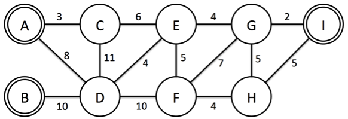
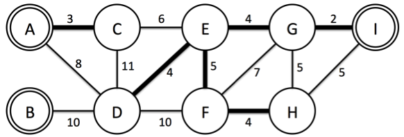

# [권준혁]

### 문제
세계에서 GDP가 가장 높은 서강 나라는 소프트웨어와 하드웨어 기술이 모두 최고라서 IT강국이라 불리고, 2015년부터 세상에서 가장 살기 좋은 나라 1등으로 꼽히고 있다. 

살기 좋은 나라 1등으로 꼽힌 이후 외국인 방문객들이 많아졌고, 그에 따라 전기 소비율이 증가하여 전기가 많이 부족한 상황이 되었다. 따라서 서강 나라의 대통령은 최근 개발이 완료된 YNY발전소 프로젝트를 진행 하기로 하였다. 발전소를 만들 때 중요한 것은 발전소 건물과 도시로 전기를 공급해 줄 케이블이다. 발전소는 이미 특정 도시에 건설되어 있고, 따라서 추가적으로 드는 비용은 케이블을 설치할 때 드는 비용이 전부이다. 이 프로젝트의 문제는 케이블을 설치할 때 드는 비용이 굉장히 크므로 이를 최소화해서 설치하여 모든 도시에 전기를 공급하는 것이다. 여러분은 N개의 도시가 있고 M개의 두 도시를 연결하는 케이블의 정보와 K개의 YNY발전소가 설치된 도시가 주어지면 케이블 설치 비용을 최소로 사용하여 모든 도시에 전기가 공급할 수 있도록 해결해야 한다. 중요한 점은 어느 한 도시가 두 개의 발전소에서 전기를 공급받으면 낭비가 되므로 케이블이 연결되어있는 도시에는 발전소가 반드시 하나만 존재해야 한다. 아래 Figure 1를 보자. 9개의 도시와 3 개의 YNY발전소(A,B,I)가 있고, 각각의 도시들을 연결할 때 드는 비용이 주어진다.

  
  

이 예제에서 모든 도시에 전기를 공급하기 위하여 설치할 케이블의 최소 비용은 22이고, Figure 2의 굵은 간선이 연결한 케이블이다. B 도시는 연결된 도시가 하나도 없지만, 발전소가 설치된 도시는 전기가 공급될 수 있기 때문에 상관없다.  

### 입력
첫째 줄에는 도시의 개수 N(1 ≤ N ≤ 1,000)과 설치 가능한 케이블의 수 M(1 ≤ M ≤ 100,000)개, 발전소의 개수 K(1 ≤ K ≤ N)개가 주어진다. 둘째 줄에는 발전소가 설치된 도시의 번호가 주어진다. 셋째 줄부터 M개의 두 도시를 연결하는 케이블의 정보가 u, v, w로 주어진다. 이는 u도시와 v도시를 연결하는 케이블을 설치할 때 w의 비용이 드는 것을 의미한다. w는 10,000보다 작거나 같은 양의 정수이다.  

### 출력
모든 도시에 전기를 공급할 수 있도록 케이블을 설치하는 데 드는 최소비용을 출력한다.  

## 접근법 (생각의 흐름 설명)
문제 요약:  

N개 도시 (도시들 중 일부에 발전소가 있음)
M개 케이블
K개 발전소
케이블 설치 비용을 최소화
모든 도시에 전기가 공급될 수 있도록 (서브 그래프의 노드 중 하나가 발전소여야 함)
하나의 도시는 하나의 발전소랑만 연결되어야 함. (하나의 도시가 2개 발전소에 이어지면 안됨)
발전소가 설치된 도시는 전기가 공급될 수 있기 때문에 상관없다. (이어질 필요가 없음)

최소한의 케이블 길이만으로 **모든 도시**를 이어줘야 하는 문제  
이는 최소 가중치를 가지는 스패닝 트리를 찾는 문제임.   

## 상세한 해설
모든 도시는 하나의 발전소와 연결되어야 하므로, 어느 도시가 2개 이상의 발전소와 이어지면 안됨.  
따라서 발전소가 부모 노도인 스패닝 트리를 찾아가면 됨.  
최소의 가중치 합을 가져야 하므로 크루스칼 알고리즘에 아래 조건만 추가해주면 됨:  
if find한 부모 노드가 서로 발전소이면 연결 x  

```python
def check(a, b):
    global P
    # 부모 노드가 같거나 OR 부모 노드가 모두 서로 다른 발전소
    if (a == b) or (a in P and b in P):
        return False
    return True
```

```python
def union(a, b):
    global P, parent
    # 우선적으로 발전소를 부모 노드로 설정하기
    if a in P:
        parent[b] = a
    elif b in P:
        parent[a] = b
    elif a < b:
        parent[b] = a
    else:
        parent[a] = b
```

```python
    for a, b, cost in G:
        aa = find(a)
        bb = find(b)
        if check(aa, bb):
            union(aa, bb)
            answer += cost
    print(answer)
```

## 회고
신장 트리의 부모 노드를 비교하는 것이 핵심 아이디어였다.

## Solution

<!--전체 코드 첨부-->

```python
import sys
input = sys.stdin.readline

def find(v):
    global parent
    if parent[v] == v:
        return v
    else:
        return find(parent[v])

def check(a, b):
    global P
    # 부모 노드가 같거나 OR 부모 노드가 모두 서로 다른 발전소
    if (a == b) or (a in P and b in P):
        return False
    return True

def union(a, b):
    global P, parent
    # 우선적으로 발전소를 부모 노드로 설정하기
    if a in P:
        parent[b] = a
    elif b in P:
        parent[a] = b
    elif a < b:
        parent[b] = a
    else:
        parent[a] = b

if __name__ == '__main__':
    N, M, K = map(int, input().split())
    P = set(map(int, input().split()))
    G = [list(map(int, input().split())) for _ in range(M)]
    G = sorted(G, key=lambda x:x[2])
    parent = [i for i in range(N + 1)]
    answer = 0
    for a, b, cost in G:
        aa = find(a)
        bb = find(b)
        if check(aa, bb):
            union(aa, bb)
            answer += cost
    print(answer)
```